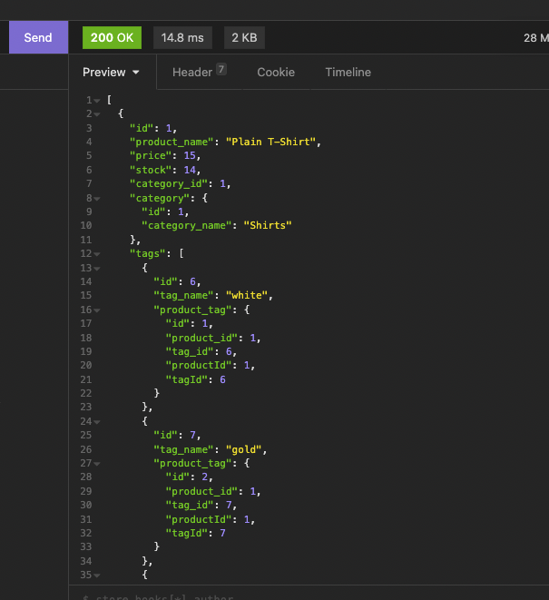

# Inventory Management Server Side  

  
  ## Description  

  An Express, SQL, and node exercise that manages 4 tables in a database for various products, in various categories, and with different tags.  

  * Motivation  

    E-commerce and digital inventory management is such a crucial part of modern business success that I wanted to better understand it.  

  * Reason for Building  

    To emulate the success of web services such as those orchestrated by Amazon or Ebay on a smaller scale.  

  * Problems Solved  

    Updating and interfacing with a database to better track product inventory.  

  * Things Learned  

    This was a good exercise in combining 3 separate technologies into one cohesive package. This was my first time implementing the sequelize npm, and my first time using express apis with asynchronous functions (as opposed to promises or callbacks),  
  ## Table of Contents  

  * [Installation](#installation)  

  * [Usage](#usage)  

  * [License](#license)  

  * [Contributing](#contributing)  

  * [Tests](#tests)  

  * [Questions](#questions)  
  ## Installation  

  navigate to the directory and run the following 2 commands  

  > npm install  
  > npm start  
  ## Usage  

  You can check out [this video walkthrough Demo](https://drive.google.com/file/d/1t2V2zc8JMfljUFVuHQTuGfYzDYkONgU8/view)

  Launch the server with the above commands after establishing a SQL database. You will need to give the configuration file your MySQL username, database name, and password. You can seed the database using:  
  > npm run seed
  
  Once you have a server running, you can make all 4 C.R.U.D. (create, read, update, delete) requests through HTTP (Get, Put, Post, Delete) protocols to the various api routes. Get requests can be made with your favorite browser. Post, Put, and Delete requests will require a devtool capable of making server requests such as Insomnia or Potman etc. Screenshot from insomnia showing the product database below.

   
  ## License  

  [MIT](https://opensource.org/licenses/MIT)  
  ## Contributing  

  Junhyoon, Merry Rowe, Michael Basch  
  ## Tests  
  
  This application does not have any written tests as of this time  
  ## Questions  

  Reach out if you have any questions about this project.